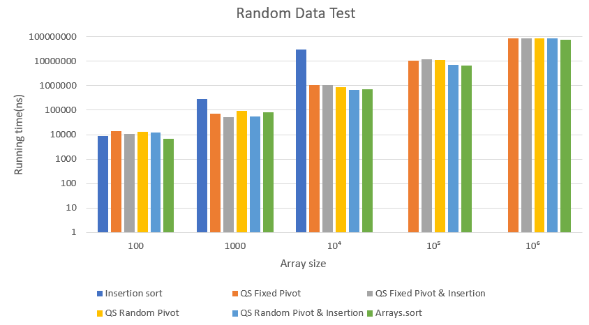
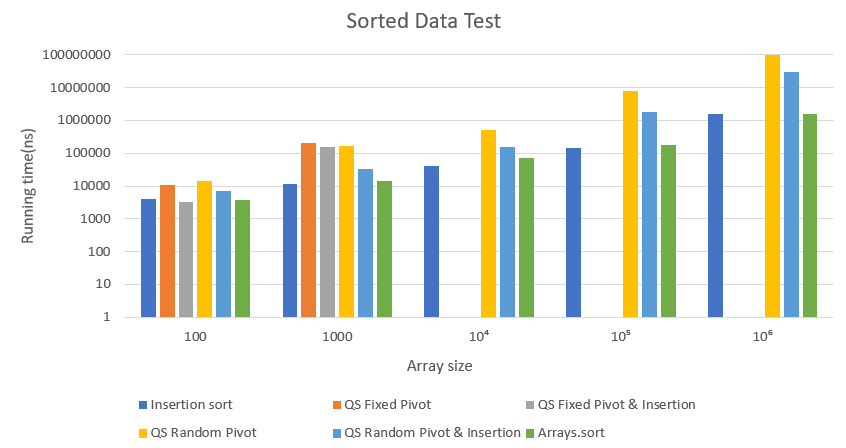
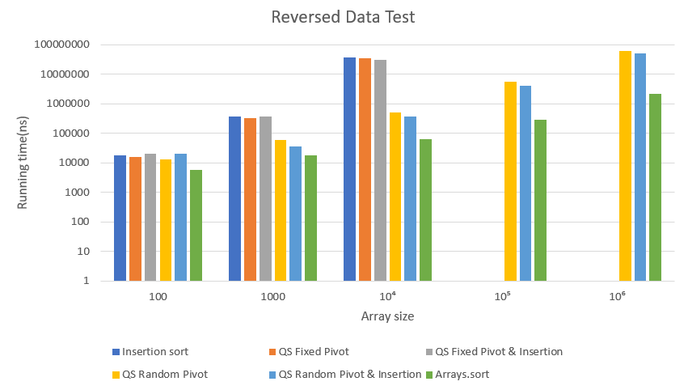
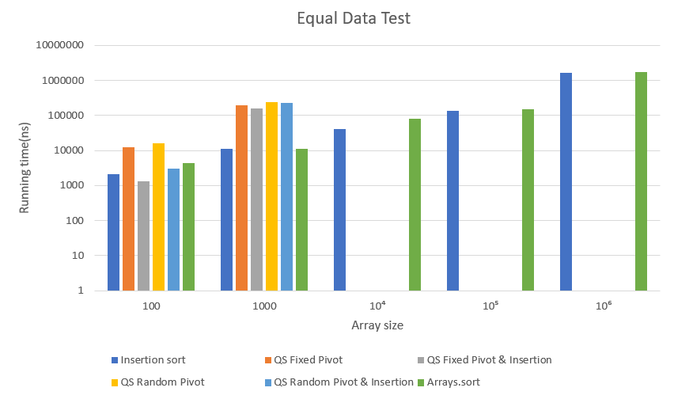

# A Study of Quicksort

Farhan Syed  
INDA Group Amanda  
2022

## Characteristics and Complexity

In 1959, Tony Hoare created the sorting algorithm Quicksort. 
Quicksort is known as a divide-and-conquer algorithm because it splits the given array into many 
smaller arrays and then uses recursion to sort the smaller arrays.  

  Quicksort has a best and average case of *O(n log n)*. 
This occurs when the data is random and the chosen pivot is the midpoint of the elements in the array.
However, if a pivot is poorly chosen i.e. the pivot is the largest or smallest element 
in the array, the time complexity is greatly affected and the worst case 
becomes *O(n2)*. As a result, Quicksort performs poorly when sorting an array 
that is already sorted or that contains many repeating elements.

## Variations of Quicksort

Four quicksort algorithms were implemented. 
The first used a fixed pivot for every partitioning and this was chosen to be
the last element in the array. Another variation was identical to this, 
except that it used an insertion sort for arrays smaller than 100. This number was chosen to optimize the 
sorting process and decrease the running time for smaller arrays by using insertion sort instead of quicksort. The third implementation used a random pivot for every partitioning, while the final 
variation used both a random pivot and an insertion sort for arrays with a size smaller
than 100. The different variations all used the same Lomuto partitioning method found in a parent class.

 

*Quicksort with a fixed pivot*  

    private void quickSort(int[] array, int low, int high){
        if(low < high){
            int pivot = array[high];

            pivot = partition(array,low,high, pivot);
            quickSort(array, low, pivot - 1);
            quickSort(array, pivot + 1, high);
        }
    }

*Quicksort with a fixed pivot and an insertion sort.*  
    
    private void quickSort(int[] array, int low, int high){
        if(low < high){
            if(high-low > 100){
                int pivot = array[high];

                pivot = partition(array,low,high, pivot);
                quickSort(array, low, pivot - 1);
                quickSort(array, pivot + 1, high);
            }
            else{
                iSort(array,low,high+1);
            }
        }
    }

*Quicksort with a random pivot*  
    
    private void quickSort(int[] array, int low, int high) {
        if (low < high) {
            int pivot = low + random.nextInt((high-low));
            swap(pivot, high, array);
            pivot = array[high];

            pivot = partition(array, low, high, pivot);
            quickSort(array, low, pivot - 1);
            quickSort(array, pivot + 1, high);
        }
    }

*Quicksort with a random pivot and an insertion sort*  
    
    private void quickSort(int[] array, int low, int high) {
        if(low < high){
            if(high-low > 100){
                int pivot = low + random.nextInt((high-low));
                swap(pivot, high, array);
                pivot = array[high];

                pivot = partition(array, low, high, pivot);
                quickSort(array, low, pivot - 1);
                quickSort(array, pivot + 1, high);
            }
            else {
                iSort(array,low,high+1);
            }
        }
    }

*The Lomuto partitioning method*

    public int partition(int[] array, int low, int high, int pivot){
        int i = low - 1;                            

        for (int j = low; j <= high-1; j++) {
            if(array[j] <= pivot){
                i++;                                
                swap(i, j,array);
            }
        }
        swap(i+1, high,array);
        return i+1;
    }

## Methodology

A testing method was created to test the execution time of insertion sort, the four quicksort implementations, and Arrays.sort, 
when sorting arrays of different sizes. These arrays were also of four varying types and contained random, sorted, reversed, or equal elements. 
After these parameters were chosen, the calculateTime method used a for-loop to generate a new array of the selected type, 
sort it, and time the sorting process. The for-loop ran for 550 repetitions in order 
to provide more precise results. The first 50 repetitions were added to ensure that the JVM with Just-in-time compilation 
did not provide anomalous results, as the code may experience a larger execution time for the first few tests because the code needs to be 
compiled and optimized. The other 500 repetitions were used to measure the average 
execution time of the sorting algorithm. This time was then noted down in the results table. 

 

*Example of how a test was conducted*
    
    public static void main(String[] args) {
        int size = 1000;
        Data data = new Data(size, size, Data.Order.RANDOM);
        QuicksortFixedPivot fixedPivot = new QuicksortFixedPivot();

        calculateTime(fixedPivot, data);
    }

*The calculateTime method*

    private static void calculateTime(IntSorter sortingAlgorithm, Data data) {
        final int reps = 500;
        final int extraStartingReps = 50;
        final Stopwatch clock = new Stopwatch();

        long sumOfAllTimes = 0;
        long time = 0;
        for (int i = 0; i < reps + extraStartingReps; i++) {

            clock.reset().start(); {
                sortingAlgorithm.sort(data.get());
            }
            time = clock.stop().nanoseconds();
            
            if (i >= extraStartingReps) {
                sumOfAllTimes += time;
            }
        }
        System.out.println("Average time: " + sumOfAllTimes/reps + " ns");
    }

## Results

A "-" indicates that the running time was too long for the experiment.
"SO" means stack overflow i.e. the program ran out of memory. 

### Test 1: Random Data

| Test 1: Random Data 

|

 |

 | 

|

|

 |  

            |
| ------------------  | ------------- | ----- |-----   | ----- | ----- | ------------- |
| Array Size          | InsertionSort (ns)| QS Fixed Pivot (ns)  | QS Fixed Pivot & Insertion (ns)| QS Random Pivot (ns) | QS Random Pivot & Insertion (ns)    | Arrays.sort (ns)   |
| 100                 |  8835       |       13 594      |           10 906         |     13 330             |     12 481      |    6569            |
| 1000                |  276 773    |      70 153       |           52 288         |     90 908             |     53 963      |    81 154            |
| 10 000              |  31 152 068 |      1 052 220    |           1 060 072      |     897 303            |      653 787    |     707 611           |
| 100 000             |      -         |     10 565 473   |           12 207 634    |     11 029 046         |     7 130 225  |     6 859 731           |
| 1 000 000           |      -         |      86 023 896 |           84 926 532    |     85 506 520         |    83 958 645   |     76 365 065           |

 

<figcaption align = "center"><b>Figure 1 - Random Data</b></figcaption>

 

### Test 2: Sorted Data

| Test 2: Sorted Data 

|

 |

 | 

|

|

 |  

            |
| ------------------  | ------------- | ----- |-----   | ----- | ----- | ------------- |
| Array Size          | InsertionSort (ns) | QS Fixed Pivot (ns) | QS Fixed Pivot & Insertion (ns) | QS Random Pivot (ns) | QS Random Pivot & Insertion (ns)   | Arrays.sort (ns)   |
| 100                 |  4105       |       10 974   |           3206        |     14 094           |     7260    |    3865           |
| 1000                |  11 771     |      198 217     |           153 216   |     166 410            |     32 112     |    14 306           |
| 10 000              |  40 523     |  SO               |           SO     |     510 512          |      153 673   |     70 315         |
| 100 000             |  145 040    |     SO             |           SO    |     7 641 880        |     1 762 533  |     175 368         |
| 1 000 000           |   1 603 393  |      SO            |           SO    |     95 456 804       |    30 810 906 |     1 533 947          |

 

<figcaption align = "center"><b>Figure 2 - Sorted Data</b></figcaption>

 

### Test 3: Reversed Data

| Test 3: Reversed Data 

|

 |

 | 

|

|

 |  

            |
| ------------------  | ------------- | ----- |-----   | ----- | ----- | ------------- |
| Array Size          | InsertionSort (ns) | QS Fixed Pivot (ns) | QS Fixed Pivot & Insertion (ns) | QS Random Pivot (ns) | QS Random Pivot & Insertion (ns)   | Arrays.sort (ns)   |
| 100                 |  18 323       |       16 036   |           20 235       |     13 419           |     20 592    |    5801          |
| 1000                |  382 496     |      335 810     |           369 396   |     60 304           |     35 939     |    17 736           |
| 10 000              |  37 993 639     |  34 821 737    |           30 635 345     |     512 703         |      364 683   |     64 554         |
| 100 000             |  -              |     SO             |           SO    |     5 487 203        |     3 972 491  |     281 060         |
| 1 000 000           |   -             |      SO            |           SO    |     63 234 670      |    50 513 698 |     2 193 987         |

 

<figcaption align = "center"><b>Figure 3 - Reversed Data</b></figcaption>

 

### Test 4: Equal Data

| Test 4: Equal Data 

|

 |

 | 

|

|

 |  

            |
| ------------------  | ------------- | ----- |-----   | ----- | ----- | ------------- |
| Array Size          | InsertionSort (ns) | QS Fixed Pivot (ns) | QS Fixed Pivot & Insertion (ns) | QS Random Pivot (ns) | QS Random Pivot & Insertion (ns)   | Arrays.sort (ns)   |
| 100                 |  2122       |       12 511  |           1325      |     16 491          |     3017   |    4316         |
| 1000                |  11 047     |      195 065     |           157 750   |     234 704       |     233 393    |    11 453           |
| 10 000              |  40 645     |  SO        |           SO    |     SO                 |      SO       |     82 780         |
| 100 000             |  138 176    |     SO             |           SO    |     SO        |     SO |     150 629        |
| 1 000 000           |  1 655 900   |      SO            |           SO    |     SO      |    SO |     1 758 156         |

 

<figcaption align = "center"><b>Figure 4 - Equal Data</b></figcaption>

 

## Discussion

It is visible in Figure 1 that for randomized data, all quicksort variations outperform 
insertion sort for larger arrays, with insertion sort not being able to provide acceptable running 
times for arrays of size 100 000 and 1 000 000. This is in conformity with the big O notation, 
as quicksort’s time complexity of O(n log n) is much less than insertion sort’s O(n2). 
Moreover, the quicksort implementations with insertion sort performed better than the ones without it. This is expected because for smaller arrays, insertion sort performs better than the traditional quicksort due to the many recursive calls quicksort has to make. Lastly, there is not a large difference in performance between quicksort implementations using fixed pivots and ones using random pivots, and they both performed similarly to Arrays.sort. 
This is due to the fact that when data is randomized, pivot selection is also arbitrary.

 

  It is apparent in Figure 2 that for sorted data, insertion sort is superior to the 
implemented quicksort algorithms. This is expected as an insertion sort does not have to make 
any swaps if the array is sorted, while quicksort still has to go through many swaps and 
partitions. On the other hand, Arrays.sort i.e. the most optimized quicksort in the experiment, 
performed similarly to insertion sort. This is surprising but may be due to the many optimizations 
in Arrays.sort. Moreover, implementations with random pivots performed better than ones with a 
fixed pivot. This is because the fixed pivot was always chosen to be the largest number in the 
array, while a random pivot allowed for more arrays to have a pivot closer to the midpoint. 
Due to this aspect, the fixed pivot implementations reached a stack overflow and had a time 
complexity of O(n2).

In the Reversed Data test, insertion sort performed similarly to the Random Data test 
because it had to sort all of the data. As a result, it was not able to produce any results 
for larger arrays. Moreover, similar to the Sorted Data test, fixed pivot implementations threw 
a stack overflow exception because the smallest number was always chosen as a pivot, 
making the arrays as large as possible. Arrays.sort was much quicker than all the other 
implementations as it made the best pivot selection, as seen in Figure 3.

When all the data was equal in the array, all four of the quicksort implementations threw a stack overflow 
exception for arrays of size 10 000 and above, as seen in Figure 4. This is expected because the Lomuto partitioning gives 
the quicksorts a time complexity of O(n2) when sorting equal elements, due to the 
fact that only two partitions are made. While one partition contains elements less 
than the pivot, the other must contain elements that are equal to or greater than the pivot. 
Thus, because all the elements are equal, they will all be placed in the same partition. 
Arrays.sort had a running time as quick as insertion sort’s, which has a time complexity of 
O(n) for sorted arrays. This is due to the fact that Arrays.sort uses two pivots to 
partition the data into three partitions, where the third one contains the elements equal to the pivot. 
Since all elements are placed into this middle partitions, no swaps have to be made, making 
Arrays.sort much quicker than single pivot quicksort.

In summary, neither insertion sort nor the four quicksort implementations could handle all 
forms of data of all sizes. Fixed pivot implementations were the weakest algorithms as they could only sort 
random data without reaching stack overflow, while random pivot implementations made better 
pivot selections and could also sort arrays in ascending and descending order. 
Arrays.sort was the best performing algorithm and was most similar to insertion sort for 
sorted and equal data. For random data, it performed similarly to the four quicksorts, 
while none of the sorting algorithms were as fast as Arrays.sort for reversed data. 

